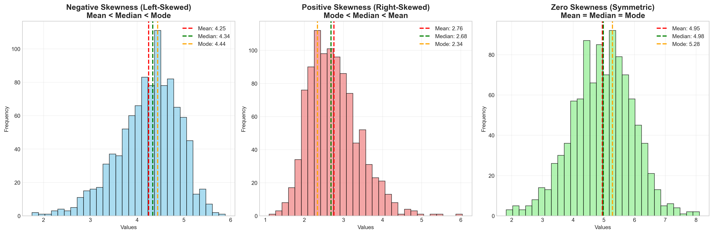
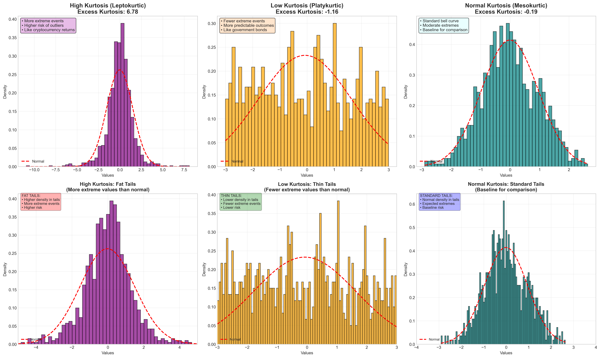

# Skewness and Kurtosis

Distribution shape characteristics that describe asymmetry and tail behavior of probability distributions.

## 🎯 Overview

Skewness and kurtosis are measures that describe the shape of a probability distribution beyond the basic measures of central tendency and spread.

## 📊 Skewness

### Definition

Skewness measures the asymmetry of a distribution around its mean.

### Types of Skewness

#### Negative Skewness (Left Skewness)

- **Mean < Median < Mode**
- **Longer or fatter tail on the left**
- **Outliers on the lower end of the distribution**
- **Most data concentrated on the right**

#### Positive Skewness (Right Skewness)

- **Mode < Median < Mean**
- **Longer or fatter tail on the right**
- **Outliers on the higher end of the distribution**
- **Most data concentrated on the left**

#### Zero Skewness

- **Symmetric distribution**
- **Mean = Median = Mode**
- **Equal tails on both sides**

## 📈 Kurtosis

### Definition

Kurtosis measures the "tailedness" of a distribution - how heavy or light the tails are compared to a normal distribution.

### Types of Kurtosis

#### Excess Kurtosis

- **Positive excess kurtosis**: More extreme events, both gains and losses
- **Negative excess kurtosis**: Fewer extreme events than normal distribution
- **Zero excess kurtosis**: Normal distribution

### Financial Implications

- **Extreme returns especially on the downside** (large negative returns)
- **Risk assessment** in financial modeling
- **Portfolio management** considerations

## 🔍 Mathematical Definitions

### Skewness Formula

```
Skewness = E[(X - μ)³] / σ³
```

### Kurtosis Formula

```
Kurtosis = E[(X - μ)⁴] / σ⁴
Excess Kurtosis = Kurtosis - 3
```

## 📊 Visual Interpretation

### Skewness

#### Negative Skewness (Left Skewed)



**Characteristics:**

- **Tail extends to the left** (negative values)
- **Most data concentrated on the right**
- **Mean < Median < Mode**
- **Outliers pull mean down**

#### Positive Skewness (Right Skewed)


**Characteristics:**

- **Tail extends to the right** (positive values)
- **Most data concentrated on the left**
- **Mode < Median < Mean**
- **Outliers pull mean up**

#### Zero Skewness (Symmetric)


**Characteristics:**

- **Perfectly symmetric around center**
- **Equal tails on both sides**
- **Mean = Median = Mode**
- **No directional bias**

### Kurtosis

#### High Kurtosis (Leptokurtic)



**Characteristics:**

- **Sharp, narrow peak**
- **Heavy, fat tails**
- **More extreme values than normal**
- **Concentrated around mean with outliers**

#### Low Kurtosis (Platykurtic)


**Characteristics:**

- **Broad, flat peak**
- **Thin, light tails**
- **Fewer extreme values**
- **More uniform distribution**

#### Normal Kurtosis (Mesokurtic)


**Characteristics:**

- **Standard bell curve shape**
- **Moderate peak and tails**
- **Baseline for comparison**
- **Excess kurtosis = 0**

## 💼 Financial Applications

### Risk Management

- **Tail risk assessment**
- **Value at Risk (VaR) calculations**
- **Stress testing scenarios**

### Portfolio Analysis

- **Return distribution analysis**
- **Asset allocation decisions**
- **Risk-adjusted performance measures**

### Market Analysis

- **Volatility clustering**
- **Fat tail events**
- **Black swan event preparation**

## 🔗 Impact on Statistical Tests

### Assumptions

- **Many tests assume normality**
- **Skewed data may violate assumptions**
- **High kurtosis affects standard errors**

### Solutions

- **Transform data** (log, square root)
- **Use robust methods**
- **Non-parametric alternatives**

## 📝 Practical Examples

### Example 1: Income Distribution

- **Typically right-skewed**
- **Most people earn below mean**
- **Few high earners create long right tail**

### Example 2: Stock Returns

- **Often leptokurtic** (high kurtosis)
- **More extreme events than normal distribution**
- **Risk models need to account for fat tails**

### Example 3: Test Scores

- **May be left-skewed** (ceiling effect)
- **Most students score near maximum**
- **Few low scores create left tail**

## 🚨 Common Mistakes

1. **Ignoring skewness in hypothesis tests**
2. **Assuming normal distribution without checking**
3. **Not considering financial implications**
4. **Focusing only on mean and variance**

## 💡 Best Practices

1. **Always examine distribution shape**
2. **Consider transformations for skewed data**
3. **Use appropriate statistical methods**
4. **Account for kurtosis in risk models**
5. **Visualize distributions before analysis**

## 🐍 Python Code Examples

### Generating Skewness Examples

```python
import numpy as np
from scipy import stats
import matplotlib.pyplot as plt

# Set random seed for reproducibility
np.random.seed(42)

# Generate different types of skewness
negative_skew = stats.skewnorm.rvs(a=-3, loc=5, scale=1, size=1000)
positive_skew = stats.skewnorm.rvs(a=3, loc=2, scale=1, size=1000)
zero_skew = np.random.normal(loc=5, scale=1, size=1000)

# Calculate statistics
def calculate_mode(data, bins=30):
    """Calculate mode using histogram method for continuous data"""
    hist, bin_edges = np.histogram(data, bins=bins)
    mode_idx = np.argmax(hist)
    mode_value = (bin_edges[mode_idx] + bin_edges[mode_idx + 1]) / 2
    return mode_value

# Print results
print("Negative Skewness:")
print(f"Mean: {np.mean(negative_skew):.3f}")
print(f"Median: {np.median(negative_skew):.3f}")
print(f"Mode: {calculate_mode(negative_skew):.3f}")
print(f"Skewness: {stats.skew(negative_skew):.3f}")
```

### Generating Kurtosis Examples

```python
# Generate different types of kurtosis
high_kurtosis = np.random.standard_t(df=3, size=1000)  # Student's t
low_kurtosis = np.random.uniform(-3, 3, size=1000)     # Uniform
normal_kurtosis = np.random.standard_normal(size=1000)  # Normal

# Calculate kurtosis
print("High Kurtosis (Student's t):")
print(f"Kurtosis: {stats.kurtosis(high_kurtosis):.3f}")

print("Low Kurtosis (Uniform):")
print(f"Kurtosis: {stats.kurtosis(low_kurtosis):.3f}")

print("Normal Kurtosis:")
print(f"Kurtosis: {stats.kurtosis(normal_kurtosis):.3f}")
```

### Financial Returns Example

```python
# Simulate financial returns
days = 252 * 5  # 5 years of daily data

# Normal returns (like government bonds)
normal_returns = np.random.normal(0.0005, 0.02, days)

# Skewed returns (like growth stocks)
skewed_returns = stats.skewnorm.rvs(a=2, loc=0.0005, scale=0.02, size=days)

# High kurtosis returns (like cryptocurrency)
high_kurt_returns = np.random.standard_t(df=3, size=days) * 0.02 + 0.0005

# Calculate cumulative returns
normal_cumulative = np.cumprod(1 + normal_returns)
skewed_cumulative = np.cumprod(1 + skewed_returns)
high_kurt_cumulative = np.cumprod(1 + high_kurt_returns)

print("Final values after 5 years:")
print(f"Normal: ${normal_cumulative[-1]:.2f}")
print(f"Skewed: ${skewed_cumulative[-1]:.2f}")
print(f"High Kurtosis: ${high_kurt_cumulative[-1]:.2f}")
```

## 📈 Interactive Visualizations

For detailed visualizations and examples, see the generated plots:

- [Skewness Examples](../visualizations/skewness_examples.png)
- [Kurtosis Examples](../visualizations/kurtosis_examples.png)
- [Distribution Comparison](../visualizations/distribution_comparison.png)
- [Financial Example](../visualizations/financial_example.png)

To generate these visualizations yourself, run:

```bash
python3 visualizations/skewness_kurtosis_examples.py
```

---

_← [Statistical Concepts](./README.md) | [Type I and Type II Errors](./type-errors.md) →_
